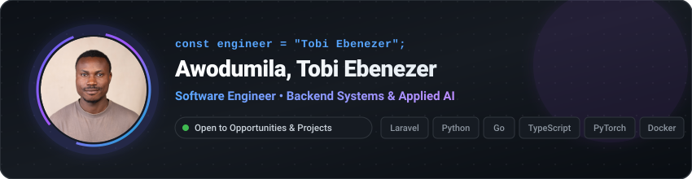

  

<h1 align="center">Hi there 👋 I'm Tobi 👨‍💻</h1>

  Senior Software Engineer building resilient backend architectures, production web applications, and applied AI systems.

  
  
  
  

  
  

  
📦 <b>Published Packages &amp; Tools</b>

   

| Package | Summary | Ecosystem | Status |
| :--- | :--- | :--- | :--- |
| [**`tobiebenezer/php-ai`**](https://github.com/tobiebenezer/php-ai) | Multi-provider LLM assistant orchestration framework for PHP | PHP 8 / Laravel |   |

  
🚀 <b>Featured Projects</b>

   

| Project | Domain | Summary | Tech Stack |
| :--- | :--- | :--- | :--- |
| [**`chainpulse_web`**](https://github.com/tobiebenezer/chainpulse_web) | Full-Stack | Real-time blockchain analytics and event monitoring dashboard | Next.js 16, React 19, TypeScript |
| [**`soccer_vision`**](https://github.com/tobiebenezer/soccer_vision) | Computer Vision | Match video tracking, player detection, and tactical analytics | Python, YOLO, OpenCV |
| [**`land_cover_prediction`**](https://github.com/tobiebenezer/land_cover_prediction) | Deep Learning | Satellite NDVI time-series forecasting with PatchTST &amp; TFT | PyTorch, Transformers, Einops |
| [**`bloodbit`**](https://github.com/tobiebenezer/bloodbit) | Backend API | Healthcare REST API with JWT auth and database migrations | Flask, SQLAlchemy, Docker |
| [**`JS-RAG`**](https://github.com/tobiebenezer/JS-RAG) | RAG Engine | PDF document ingestion and multi-vector search pipeline | Node.js, Qdrant, Chroma, Ollama |
| [**`cold_email_generator`**](https://github.com/tobiebenezer/cold_email_generator) | Local AI Tool | Private job spec extraction and tailored outreach drafts | LangChain, Ollama, Streamlit |
| [**`quizer`**](https://github.com/tobiebenezer/quizer) | Full-Stack | Interactive assessment and quiz platform | Laravel, Livewire 3, Tailwind |

  
🛠️ <b>Tech Stack</b>

   

  <b>Languages &amp; Core</b> 
  
  
  
  
  
  

  <b>Frameworks &amp; Backend</b> 
  
  
  
  
  
  

  <b>Applied AI &amp; Infrastructure</b> 
  
  
  
  
  
  

  
💻 <b>Engineering Setup &amp; Preferences</b>

   

- ⚙️ **Operating System**: Linux (Ubuntu)
- 🛠️ **Primary Stack**: PHP (Laravel) • Python • TypeScript • Go
- 🎯 **Engineering Focus**: High-throughput APIs, clean database architecture, Dockerized microservices, applied ML in production
- 💬 **Collaboration**: Open to senior software engineering roles, high-impact backend contracts, and applied AI systems

